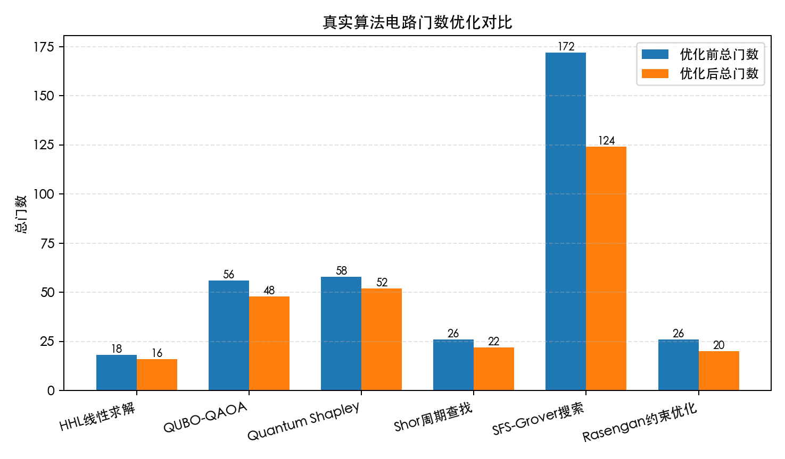

# 132 仿真工具支持计算复杂度对比分析 func-132 测试结果

## 测试对象

`/home/zhenyusen/double-quant/src/double_quant/algorithm` 中真实算法电路，以及 `simulator/analysis.py` 中复杂度分析实现。

## 测试命令

```bash
.venv/bin/python tests/scripts/132-complexity_comparison.py
```

## 程序输出

```text
132 仿真工具支持计算复杂度对比分析（真实算法门数优化）: PASS
HHL线性求解优化前总门数：18
HHL线性求解优化后最小总门数：16
HHL线性求解总门数减少：2
HHL线性求解最佳优化等级：2
QUBO-QAOA优化前总门数：56
QUBO-QAOA优化后最小总门数：48
QUBO-QAOA总门数减少：8
QUBO-QAOA最佳优化等级：1
Quantum Shapley优化前总门数：58
Quantum Shapley优化后最小总门数：52
Quantum Shapley总门数减少：6
Quantum Shapley最佳优化等级：2
Shor周期查找优化前总门数：26
Shor周期查找优化后最小总门数：22
Shor周期查找总门数减少：4
Shor周期查找最佳优化等级：2
SFS-Grover搜索优化前总门数：172
SFS-Grover搜索优化后最小总门数：124
SFS-Grover搜索总门数减少：48
SFS-Grover搜索最佳优化等级：1
Rasengan约束优化优化前总门数：26
Rasengan约束优化优化后最小总门数：20
Rasengan约束优化总门数减少：6
Rasengan约束优化最佳优化等级：1
门数优化对比图：docs/132-complexity_comparison/images/132_gate_count_optimization.png
```

## 图片输出



## 关键结果

- HHL 线性求解电路总门数由 18 降至 16。
- QUBO-QAOA 电路总门数由 56 降至 48。
- Quantum Shapley 电路总门数由 58 降至 52。
- Shor 周期查找电路总门数由 26 降至 22。
- SFS-Grover 搜索电路总门数由 172 降至 124。
- Rasengan 约束优化电路总门数由 26 降至 20。

## 输出说明

程序输出和图片均针对 `src/double_quant/algorithm` 中六类算法电路，记录 Qiskit transpiler 不同优化等级下的门数优化结果。
