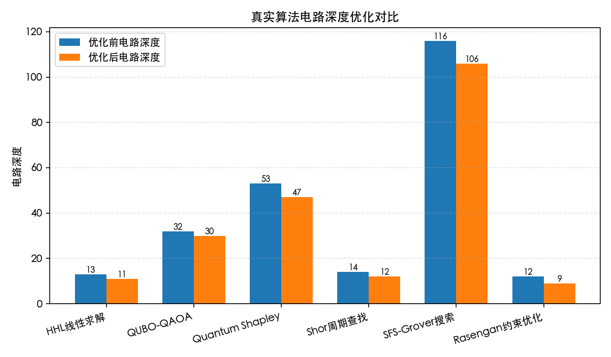

# 133 仿真工具支持算法复杂度优化 func-133 测试结果

## 测试对象

`/home/zhenyusen/double-quant/src/double_quant/algorithm` 中真实算法电路，以及 `simulator/analysis.py` 中复杂度分析实现。

## 测试命令

```bash
.venv/bin/python tests/scripts/133-circuit_depth_optimization.py
```

## 程序输出

```text
133 仿真工具支持算法复杂度优化（真实算法深度优化）: PASS
HHL线性求解优化前电路深度：13
HHL线性求解优化后最小电路深度：11
HHL线性求解电路深度减少：2
HHL线性求解最佳优化等级：2
QUBO-QAOA优化前电路深度：32
QUBO-QAOA优化后最小电路深度：30
QUBO-QAOA电路深度减少：2
QUBO-QAOA最佳优化等级：1
Quantum Shapley优化前电路深度：53
Quantum Shapley优化后最小电路深度：47
Quantum Shapley电路深度减少：6
Quantum Shapley最佳优化等级：2
Shor周期查找优化前电路深度：14
Shor周期查找优化后最小电路深度：12
Shor周期查找电路深度减少：2
Shor周期查找最佳优化等级：2
SFS-Grover搜索优化前电路深度：116
SFS-Grover搜索优化后最小电路深度：106
SFS-Grover搜索电路深度减少：10
SFS-Grover搜索最佳优化等级：1
Rasengan约束优化优化前电路深度：12
Rasengan约束优化优化后最小电路深度：9
Rasengan约束优化电路深度减少：3
Rasengan约束优化最佳优化等级：1
深度优化对比图：docs/133-circuit_depth_optimization/images/133_depth_optimization.png
```

## 图片输出



## 关键结果

- HHL 线性求解电路深度由 13 降至 11。
- QUBO-QAOA 电路深度由 32 降至 30。
- Quantum Shapley 电路深度由 53 降至 47。
- Shor 周期查找电路深度由 14 降至 12。
- SFS-Grover 搜索电路深度由 116 降至 106。
- Rasengan 约束优化电路深度由 12 降至 9。

## 输出说明

程序输出和图片均针对 `src/double_quant/algorithm` 中六类算法电路，记录 Qiskit transpiler 不同优化等级下的电路深度优化结果。
